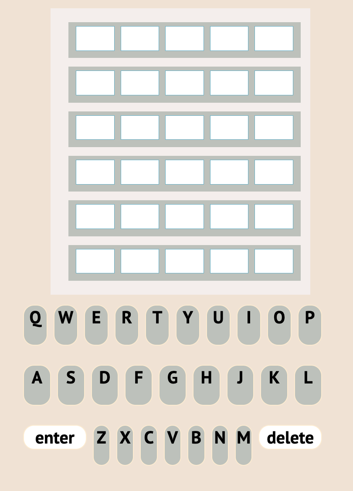
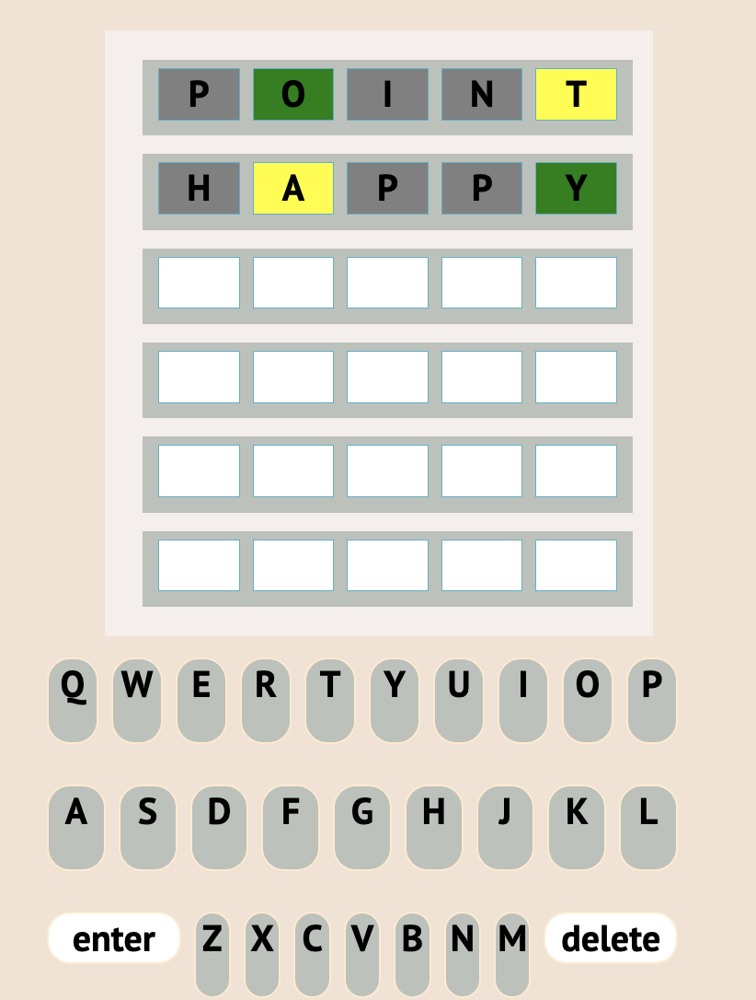
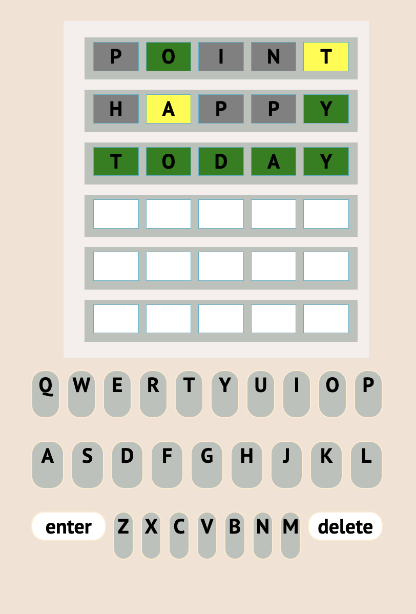

# WORDLE GAME CLONE

In this project, I attempted to create a WORDLE game clone since it is a game that I love playing everyday, and I thought how hard could making it be?
SPOILER: very hard..

## 1. Start Page

this is what the user sees upon opening the game. The user gets 6 tries to guess the word of the day. The user gets to see if the letter entered is correct or not based on the color of the tiles.

## 2. Adding a word

After choosing the letter from the alphabets below and pressing enter, the tiles change color based on the "correctness" of each letter. A green tile indicates correct letter and position, a yellow tile indicates a correct letter but not position and a grey tile indicates an incorrect letter.

## 3. Guessing the word correctly

If all the letters turn green, then this means the user guessed the word correctly!!

To try out the game click [here](https://zainabdhaif.github.io/wordle-project/). 